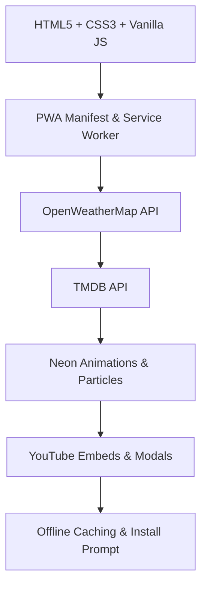

# Tech-Hipster-v2
<div align="center">

# 🚀 **TECH HIPSTER PORTFOLIO v3.0** 🚀

  
*(Replace with custom neon banner image)*

<p align="center">
  
</p>

<h1 align="center">
  <span style="background: linear-gradient(45deg, #ff00ff, #00ffff, #39ff14, #9d00ff, #ff00ff); -webkit-background-clip: text; -webkit-text-fill-color: transparent; font-size: 4rem; font-weight: 900; text-shadow: 0 0 40px #ff00ff, 0 0 80px #00ffff;">
    TECH HIPSTER | NEON CORE v3.0
  </span>
</h1>

<p align="center">
  <em style="color: #00ffff; text-shadow: 0 0 15px #00ffff; font-size: 1.5rem;">
    🌤️ Interactive PWA Portfolio with Weather Forecasts & Movie Trailers 🌟
  </em><br>
  <span style="color: #39ff14; text-shadow: 0 0 10px #39ff14;">
    Full-Stack Coder • Cyber Romantic • Neon Dreamer • API Wizard
  </span>
</p>

<p align="center">
  <a href="#live-demo">🔴 Live Demo</a> •
  <a href="#install-as-app">📱 Install PWA</a> •
  <a href="#features">✨ Features</a> •
  <a href="#new-in-v3">🆕 What's New v3.0</a> •
  <a href="#tech-stack">⚡ Tech Stack</a> •
  <a href="#installation">🚀 Setup</a> •
  <a href="#contact">📞 Contact</a>
</p>

</div>

---

## 🏆 **Status Badges & Logos**

<div align="center">

### Core Tech Badges
[](https://developer.mozilla.org/en-US/docs/Web/HTML)
[](https://developer.mozilla.org/en-US/docs/Web/CSS)
[](https://developer.mozilla.org/en-US/docs/Web/JavaScript)
[](https://developer.mozilla.org/en-US/docs/Web/Progressive_web_apps)

### API Integrations
[](https://openweathermap.org/api)
[](https://developer.themoviedb.org/reference/intro/getting-started)

### Performance & Style
[](https://developer.mozilla.org/en-US/docs/Web/API/Service_Worker_API)
[](https://neon.sh)
[](https://developer.mozilla.org/en-US/docs/Learn/CSS/CSS_layout/Responsive_Design)
[](https://developer.mozilla.org/en-US/docs/Web/CSS/CSS_Animations/Using_CSS_custom_properties)

### Stats & Social
[](https://semver.org/)
[](LICENSE)
[](https://github.com/Bibs-Hacker/Tech-Hipster-V2)
[](https://web.dev/vitals/)

[](https://github.com/Bibs-Hacker/Tech-Hipster-V2/stargazers)
[](https://github.com/Bibs-Hacker/Tech-Hipster-V2/network/members)
[](https://github.com/yourusername/tech-hipster-portfolio/issues)
[](https://github.com/Bibs-Hacker/Tech-Hipster-v2/blob/main/LICENSE)

[](https://github.com/Bibs-Hacker)
[](https://github.com/Bibs-Hacker)

### Fun Badges
[](https://cyberpunk.net/)
[](https://en.wikipedia.org/wiki/Romance_(love))
[](https://developer.mozilla.org/en-US/docs/Learn/JavaScript/Client-side_web_APIs/Third_party_APIs)

</div>

---

## 🔴 **Live Demo**

> **🌐 Deployed & Ready to Install as PWA**

<div align="center">

[](https://techhipster.netlify.app)
[](https://tech-hipster-v2.netlify.app)

> *Replace with your actual deployment URL (e.g., GitHub Pages / Netlify)*

</div>

**Quick Test:**  
- Open in Chrome → See neon splash → Install prompt after 6s  
- Click **Weather Viewer** → Search "Nairobi" → Current + 5-day forecast  
- Click **Movie Trailers** → Search "Inception" → Infinite scroll → Click for trailer  

---

## 📸 **Screenshots (Neon Glow Edition)**

<div align="center">

| Splash & Dashboard | Weather Viewer | Movie Trailers Grid | Trailer Modal |
|--------------------|----------------|---------------------|---------------|
|  |  |  |  |

*(Replace placeholders with actual screenshots for max impact)*

</div>

---

## ✨ **Features Overview**

| Feature | Description | Icon |
|---------|-------------|------|
| **Neon Splash Screen** | Auto-fades with glitch logo, typing animation, floating profile icon | 🌟 |
| **Cyberpunk Background Video** | Looping video with 30% opacity + particle overlay | 🎥 |
| **Interactive Neon Cursor** | Glowing trail follows mouse with pulse effect | 🖱️ |
| **Floating Particle System** | 80+ neon orbs with physics-based movement | ⚡ |
| **3D Flip Profile Card** | Hover to flip & reveal skills (React, Node, etc.) | 🔄 |
| **Glitch Title + Pulse Border** | Dynamic effects on hover & dashboard border | 💥 |
| **Dark/Light Theme Toggle** | Neon glow variants with sound feedback | 🌙☀️ |
| **Modal Navigation** | Smooth slide-in sections with blur backdrops | 🚪 |
| **Live Clock & Uptime** | Real-time system stats in corner | ⏰ |
| **Confetti & Sound FX** | Fun Zone explosions + click/boot/glitch sounds | 🎉 |
| **PWA Install Prompt** | Auto-triggers in Chrome for app-like experience | 📱 |
| **Offline Support** | Full caching via Service Worker | 🔌 |

---

## 🆕 **What's New in v3.0: Weather + Movies Magic**

<div align="center">

### 🌤️ **Weather Viewer**
- **Search Bar**: Enter city (e.g., "Nairobi") → Hit Search/Enter  
- **Current Weather**: Temp, feels-like, wind speed (m/s), humidity (%), conditions  
- **5-Day Forecast**: Grid of predictions with avg temp, wind, humidity, description  
- **API**: OpenWeatherMap (free key required — replace in code)  
- **Neon Style**: Glowing cards + icons for wind/humidity  

[](https://openweathermap.org/api)

### 🎬 **Movie Trailers Section**
- **Search Bar**: Query movies (e.g., "Avengers") → Infinite scroll results  
- **Movie Cards**: Posters, titles → Click to open trailer  
- **Trailer Modal**: Full-screen YouTube embed with autoplay + back button  
- **Infinite Load**: "Load More" button for millions of films (paginated)  
- **API**: TMDB (free key required — replace in code)  

[](https://www.themoviedb.org/documentation/api)

</div>

**Romantic Twist:** Weather for date planning? Trailers for movie nights with P.J? 💕  

---

## ⚡ **Tech Stack**

<div align="center">


Full-Stack Dev    ████████████████████  100%
PWA Mastery       ████████████████████  100%
API Integration   ██████████████████▒  95%
UI/UX Neon        █████████████████░░  90%
Cyber Romance     ████████████████████  ∞%
Weather/Movies    █████████████████░░  90%
```
```
💜   Built with:
   • Blazing Neon CSS Gradients
   • Vanilla JS API Magic
   • Weather for Date Nights
   • Movie Trailers for P.J
   • 3 AM Code Sessions
   • Endless Coffee & Romance

_____          _     _   _ _     _           
   / ____|        | |   | | | (_)   | |          
  | |     ___  ___| |__ | |_| |_ ___| |_ ___ _ __ 
  | |    / _ \/ __| '_ \| __| | / __| __/ _ \ '__|
  | |___|  __/ (__| | | | |_| | \__ \ ||  __/ |   
   \_____\___|\___|_| |_|\__|_|_|___/\__\___|_|   

``
        🌤️ WEATHER API  🎬 TMDB TRAILERS  ⚡ NEON v3.0
        PWA • OFFLINE • INTERACTIVE • ROMANTIC
